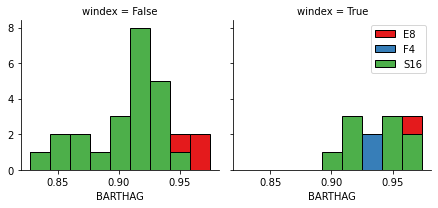
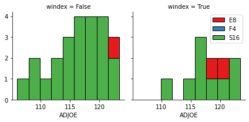
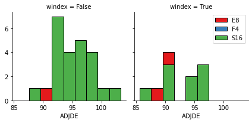

<center>
    
</center>

# Classification with Python

Estimated time needed: **25** minutes

## Objectives

After completing this lab you will be able to:

*   Confidently create classification models


In this notebook we try to practice all the classification algorithms that we learned in this course.

We load a dataset using Pandas library, and apply the following algorithms, and find the best one for this specific dataset by accuracy evaluation methods.

Let's first load required libraries:


```python
import itertools
import numpy as np
import matplotlib.pyplot as plt
from matplotlib.ticker import NullFormatter
import pandas as pd
import numpy as np
import matplotlib.ticker as ticker
from sklearn import preprocessing
%matplotlib inline
```

### About dataset


This dataset is about the performance of basketball teams. The **cbb.csv** data set includes performance data about five seasons of 354 basketball teams. It includes following fields:

| Field          | Description                                                                           |
|----------------|---------------------------------------------------------------------------------------|
|TEAM |	The Division I college basketball school|
|CONF|	The Athletic Conference in which the school participates in (A10 = Atlantic 10, ACC = Atlantic Coast Conference, AE = America East, Amer = American, ASun = ASUN, B10 = Big Ten, B12 = Big 12, BE = Big East, BSky = Big Sky, BSth = Big South, BW = Big West, CAA = Colonial Athletic Association, CUSA = Conference USA, Horz = Horizon League, Ivy = Ivy League, MAAC = Metro Atlantic Athletic Conference, MAC = Mid-American Conference, MEAC = Mid-Eastern Athletic Conference, MVC = Missouri Valley Conference, MWC = Mountain West, NEC = Northeast Conference, OVC = Ohio Valley Conference, P12 = Pac-12, Pat = Patriot League, SB = Sun Belt, SC = Southern Conference, SEC = South Eastern Conference, Slnd = Southland Conference, Sum = Summit League, SWAC = Southwestern Athletic Conference, WAC = Western Athletic Conference, WCC = West Coast Conference)|
|G|	Number of games played|
|W|	Number of games won|
|ADJOE|	Adjusted Offensive Efficiency (An estimate of the offensive efficiency (points scored per 100 possessions) a team would have against the average Division I defense)|
|ADJDE|	Adjusted Defensive Efficiency (An estimate of the defensive efficiency (points allowed per 100 possessions) a team would have against the average Division I offense)|
|BARTHAG|	Power Rating (Chance of beating an average Division I team)|
|EFG_O|	Effective Field Goal Percentage Shot|
|EFG_D|	Effective Field Goal Percentage Allowed|
|TOR|	Turnover Percentage Allowed (Turnover Rate)|
|TORD|	Turnover Percentage Committed (Steal Rate)|
|ORB|	Offensive Rebound Percentage|
|DRB|	Defensive Rebound Percentage|
|FTR|	Free Throw Rate (How often the given team shoots Free Throws)|
|FTRD|	Free Throw Rate Allowed|
|2P_O|	Two-Point Shooting Percentage|
|2P_D|	Two-Point Shooting Percentage Allowed|
|3P_O|	Three-Point Shooting Percentage|
|3P_D|	Three-Point Shooting Percentage Allowed|
|ADJ_T|	Adjusted Tempo (An estimate of the tempo (possessions per 40 minutes) a team would have against the team that wants to play at an average Division I tempo)|
|WAB|	Wins Above Bubble (The bubble refers to the cut off between making the NCAA March Madness Tournament and not making it)|
|POSTSEASON|	Round where the given team was eliminated or where their season ended (R68 = First Four, R64 = Round of 64, R32 = Round of 32, S16 = Sweet Sixteen, E8 = Elite Eight, F4 = Final Four, 2ND = Runner-up, Champion = Winner of the NCAA March Madness Tournament for that given year)|
|SEED|	Seed in the NCAA March Madness Tournament|
|YEAR|	Season


### Load Data From CSV File


Let's load the dataset \[NB Need to provide link to csv file]


```python
df = pd.read_csv('https://cf-courses-data.s3.us.cloud-object-storage.appdomain.cloud/IBMDeveloperSkillsNetwork-ML0101EN-SkillsNetwork/labs/Module%206/cbb.csv')
df.head()
```


<div>
<style scoped>
    .dataframe tbody tr th:only-of-type {
        vertical-align: middle;
    }

    .dataframe tbody tr th {
        vertical-align: top;
    }

    .dataframe thead th {
        text-align: right;
    }
</style>
<table border="1" class="dataframe">
  <thead>
    <tr style="text-align: right;">
      <th></th>
      <th>TEAM</th>
      <th>CONF</th>
      <th>G</th>
      <th>W</th>
      <th>ADJOE</th>
      <th>ADJDE</th>
      <th>BARTHAG</th>
      <th>EFG_O</th>
      <th>EFG_D</th>
      <th>TOR</th>
      <th>...</th>
      <th>FTRD</th>
      <th>2P_O</th>
      <th>2P_D</th>
      <th>3P_O</th>
      <th>3P_D</th>
      <th>ADJ_T</th>
      <th>WAB</th>
      <th>POSTSEASON</th>
      <th>SEED</th>
      <th>YEAR</th>
    </tr>
  </thead>
  <tbody>
    <tr>
      <th>0</th>
      <td>North Carolina</td>
      <td>ACC</td>
      <td>40</td>
      <td>33</td>
      <td>123.3</td>
      <td>94.9</td>
      <td>0.9531</td>
      <td>52.6</td>
      <td>48.1</td>
      <td>15.4</td>
      <td>...</td>
      <td>30.4</td>
      <td>53.9</td>
      <td>44.6</td>
      <td>32.7</td>
      <td>36.2</td>
      <td>71.7</td>
      <td>8.6</td>
      <td>2ND</td>
      <td>1.0</td>
      <td>2016</td>
    </tr>
    <tr>
      <th>1</th>
      <td>Villanova</td>
      <td>BE</td>
      <td>40</td>
      <td>35</td>
      <td>123.1</td>
      <td>90.9</td>
      <td>0.9703</td>
      <td>56.1</td>
      <td>46.7</td>
      <td>16.3</td>
      <td>...</td>
      <td>30.0</td>
      <td>57.4</td>
      <td>44.1</td>
      <td>36.2</td>
      <td>33.9</td>
      <td>66.7</td>
      <td>8.9</td>
      <td>Champions</td>
      <td>2.0</td>
      <td>2016</td>
    </tr>
    <tr>
      <th>2</th>
      <td>Notre Dame</td>
      <td>ACC</td>
      <td>36</td>
      <td>24</td>
      <td>118.3</td>
      <td>103.3</td>
      <td>0.8269</td>
      <td>54.0</td>
      <td>49.5</td>
      <td>15.3</td>
      <td>...</td>
      <td>26.0</td>
      <td>52.9</td>
      <td>46.5</td>
      <td>37.4</td>
      <td>36.9</td>
      <td>65.5</td>
      <td>2.3</td>
      <td>E8</td>
      <td>6.0</td>
      <td>2016</td>
    </tr>
    <tr>
      <th>3</th>
      <td>Virginia</td>
      <td>ACC</td>
      <td>37</td>
      <td>29</td>
      <td>119.9</td>
      <td>91.0</td>
      <td>0.9600</td>
      <td>54.8</td>
      <td>48.4</td>
      <td>15.1</td>
      <td>...</td>
      <td>33.4</td>
      <td>52.6</td>
      <td>46.3</td>
      <td>40.3</td>
      <td>34.7</td>
      <td>61.9</td>
      <td>8.6</td>
      <td>E8</td>
      <td>1.0</td>
      <td>2016</td>
    </tr>
    <tr>
      <th>4</th>
      <td>Kansas</td>
      <td>B12</td>
      <td>37</td>
      <td>32</td>
      <td>120.9</td>
      <td>90.4</td>
      <td>0.9662</td>
      <td>55.7</td>
      <td>45.1</td>
      <td>17.8</td>
      <td>...</td>
      <td>37.3</td>
      <td>52.7</td>
      <td>43.4</td>
      <td>41.3</td>
      <td>32.5</td>
      <td>70.1</td>
      <td>11.6</td>
      <td>E8</td>
      <td>1.0</td>
      <td>2016</td>
    </tr>
  </tbody>
</table>
<p>5 rows × 24 columns</p>
</div>


```python
df.shape
```


    (1406, 24)


## Add Column

Next we'll add a column that will contain "true" if the wins above bubble are over 7 and "false" if not. We'll call this column Win Index or "windex" for short.


```python
df['windex'] = np.where(df.WAB > 7, 'True', 'False')
```

# Data visualization and pre-processing


Next we'll filter the data set to the teams that made the Sweet Sixteen, the Elite Eight, and the Final Four in the post season. We'll also create a new dataframe that will hold the values with the new column.


```python
df1 = df.loc[df['POSTSEASON'].str.contains('F4|S16|E8', na=False)]
df1.head()
```


<div>
<style scoped>
    .dataframe tbody tr th:only-of-type {
        vertical-align: middle;
    }

    .dataframe tbody tr th {
        vertical-align: top;
    }

    .dataframe thead th {
        text-align: right;
    }
</style>
<table border="1" class="dataframe">
  <thead>
    <tr style="text-align: right;">
      <th></th>
      <th>TEAM</th>
      <th>CONF</th>
      <th>G</th>
      <th>W</th>
      <th>ADJOE</th>
      <th>ADJDE</th>
      <th>BARTHAG</th>
      <th>EFG_O</th>
      <th>EFG_D</th>
      <th>TOR</th>
      <th>...</th>
      <th>2P_O</th>
      <th>2P_D</th>
      <th>3P_O</th>
      <th>3P_D</th>
      <th>ADJ_T</th>
      <th>WAB</th>
      <th>POSTSEASON</th>
      <th>SEED</th>
      <th>YEAR</th>
      <th>windex</th>
    </tr>
  </thead>
  <tbody>
    <tr>
      <th>2</th>
      <td>Notre Dame</td>
      <td>ACC</td>
      <td>36</td>
      <td>24</td>
      <td>118.3</td>
      <td>103.3</td>
      <td>0.8269</td>
      <td>54.0</td>
      <td>49.5</td>
      <td>15.3</td>
      <td>...</td>
      <td>52.9</td>
      <td>46.5</td>
      <td>37.4</td>
      <td>36.9</td>
      <td>65.5</td>
      <td>2.3</td>
      <td>E8</td>
      <td>6.0</td>
      <td>2016</td>
      <td>False</td>
    </tr>
    <tr>
      <th>3</th>
      <td>Virginia</td>
      <td>ACC</td>
      <td>37</td>
      <td>29</td>
      <td>119.9</td>
      <td>91.0</td>
      <td>0.9600</td>
      <td>54.8</td>
      <td>48.4</td>
      <td>15.1</td>
      <td>...</td>
      <td>52.6</td>
      <td>46.3</td>
      <td>40.3</td>
      <td>34.7</td>
      <td>61.9</td>
      <td>8.6</td>
      <td>E8</td>
      <td>1.0</td>
      <td>2016</td>
      <td>True</td>
    </tr>
    <tr>
      <th>4</th>
      <td>Kansas</td>
      <td>B12</td>
      <td>37</td>
      <td>32</td>
      <td>120.9</td>
      <td>90.4</td>
      <td>0.9662</td>
      <td>55.7</td>
      <td>45.1</td>
      <td>17.8</td>
      <td>...</td>
      <td>52.7</td>
      <td>43.4</td>
      <td>41.3</td>
      <td>32.5</td>
      <td>70.1</td>
      <td>11.6</td>
      <td>E8</td>
      <td>1.0</td>
      <td>2016</td>
      <td>True</td>
    </tr>
    <tr>
      <th>5</th>
      <td>Oregon</td>
      <td>P12</td>
      <td>37</td>
      <td>30</td>
      <td>118.4</td>
      <td>96.2</td>
      <td>0.9163</td>
      <td>52.3</td>
      <td>48.9</td>
      <td>16.1</td>
      <td>...</td>
      <td>52.6</td>
      <td>46.1</td>
      <td>34.4</td>
      <td>36.2</td>
      <td>69.0</td>
      <td>6.7</td>
      <td>E8</td>
      <td>1.0</td>
      <td>2016</td>
      <td>False</td>
    </tr>
    <tr>
      <th>6</th>
      <td>Syracuse</td>
      <td>ACC</td>
      <td>37</td>
      <td>23</td>
      <td>111.9</td>
      <td>93.6</td>
      <td>0.8857</td>
      <td>50.0</td>
      <td>47.3</td>
      <td>18.1</td>
      <td>...</td>
      <td>47.2</td>
      <td>48.1</td>
      <td>36.0</td>
      <td>30.7</td>
      <td>65.5</td>
      <td>-0.3</td>
      <td>F4</td>
      <td>10.0</td>
      <td>2016</td>
      <td>False</td>
    </tr>
  </tbody>
</table>
<p>5 rows × 25 columns</p>
</div>


```python
df1['POSTSEASON'].value_counts()
```


    S16    32
    E8     16
    F4      8
    Name: POSTSEASON, dtype: int64


32 teams made it into the Sweet Sixteen, 16 into the Elite Eight, and 8 made it into the Final Four over 5 seasons.


Lets plot some columns to underestand data better:


```python
# notice: installing seaborn might takes a few minutes
!conda install -c anaconda seaborn -y
```

    Collecting package metadata (current_repodata.json): done
    Solving environment: done
    
    # All requested packages already installed.
    


```python
import seaborn as sns

bins = np.linspace(df1.BARTHAG.min(), df1.BARTHAG.max(), 10)
g = sns.FacetGrid(df1, col="windex", hue="POSTSEASON", palette="Set1", col_wrap=6)
g.map(plt.hist, 'BARTHAG', bins=bins, ec="k")

g.axes[-1].legend()
plt.show()
```





```python
bins = np.linspace(df1.ADJOE.min(), df1.ADJOE.max(), 10)
g = sns.FacetGrid(df1, col="windex", hue="POSTSEASON", palette="Set1", col_wrap=2)
g.map(plt.hist, 'ADJOE', bins=bins, ec="k")

g.axes[-1].legend()
plt.show()
```





# Pre-processing:  Feature selection/extraction


### Lets look at how Adjusted Defense Efficiency plots


```python
bins = np.linspace(df1.ADJDE.min(), df1.ADJDE.max(), 10)
g = sns.FacetGrid(df1, col="windex", hue="POSTSEASON", palette="Set1", col_wrap=2)
g.map(plt.hist, 'ADJDE', bins=bins, ec="k")
g.axes[-1].legend()
plt.show()

```





We see that this data point doesn't impact the ability of a team to get into the Final Four.


## Convert Categorical features to numerical values


Lets look at the postseason:


```python
df1.groupby(['windex'])['POSTSEASON'].value_counts(normalize=True)
```


    windex  POSTSEASON
    False   S16           0.605263
            E8            0.263158
            F4            0.131579
    True    S16           0.500000
            E8            0.333333
            F4            0.166667
    Name: POSTSEASON, dtype: float64


13% of teams with 6 or less wins above bubble make it into the final four while 17% of teams with 7 or more do.


Lets convert wins above bubble (winindex) under 7 to 0 and over 7 to 1:


```python
df1['windex'].replace(to_replace=['False','True'], value=[0,1],inplace=True)
df1.head()
```

    /opt/conda/envs/Python-3.7-OpenCE/lib/python3.7/site-packages/pandas/core/generic.py:6746: SettingWithCopyWarning: 
    A value is trying to be set on a copy of a slice from a DataFrame
    
    See the caveats in the documentation: https://pandas.pydata.org/pandas-docs/stable/user_guide/indexing.html#returning-a-view-versus-a-copy
      self._update_inplace(new_data)


<div>
<style scoped>
    .dataframe tbody tr th:only-of-type {
        vertical-align: middle;
    }

    .dataframe tbody tr th {
        vertical-align: top;
    }

    .dataframe thead th {
        text-align: right;
    }
</style>
<table border="1" class="dataframe">
  <thead>
    <tr style="text-align: right;">
      <th></th>
      <th>TEAM</th>
      <th>CONF</th>
      <th>G</th>
      <th>W</th>
      <th>ADJOE</th>
      <th>ADJDE</th>
      <th>BARTHAG</th>
      <th>EFG_O</th>
      <th>EFG_D</th>
      <th>TOR</th>
      <th>...</th>
      <th>2P_O</th>
      <th>2P_D</th>
      <th>3P_O</th>
      <th>3P_D</th>
      <th>ADJ_T</th>
      <th>WAB</th>
      <th>POSTSEASON</th>
      <th>SEED</th>
      <th>YEAR</th>
      <th>windex</th>
    </tr>
  </thead>
  <tbody>
    <tr>
      <th>2</th>
      <td>Notre Dame</td>
      <td>ACC</td>
      <td>36</td>
      <td>24</td>
      <td>118.3</td>
      <td>103.3</td>
      <td>0.8269</td>
      <td>54.0</td>
      <td>49.5</td>
      <td>15.3</td>
      <td>...</td>
      <td>52.9</td>
      <td>46.5</td>
      <td>37.4</td>
      <td>36.9</td>
      <td>65.5</td>
      <td>2.3</td>
      <td>E8</td>
      <td>6.0</td>
      <td>2016</td>
      <td>0</td>
    </tr>
    <tr>
      <th>3</th>
      <td>Virginia</td>
      <td>ACC</td>
      <td>37</td>
      <td>29</td>
      <td>119.9</td>
      <td>91.0</td>
      <td>0.9600</td>
      <td>54.8</td>
      <td>48.4</td>
      <td>15.1</td>
      <td>...</td>
      <td>52.6</td>
      <td>46.3</td>
      <td>40.3</td>
      <td>34.7</td>
      <td>61.9</td>
      <td>8.6</td>
      <td>E8</td>
      <td>1.0</td>
      <td>2016</td>
      <td>1</td>
    </tr>
    <tr>
      <th>4</th>
      <td>Kansas</td>
      <td>B12</td>
      <td>37</td>
      <td>32</td>
      <td>120.9</td>
      <td>90.4</td>
      <td>0.9662</td>
      <td>55.7</td>
      <td>45.1</td>
      <td>17.8</td>
      <td>...</td>
      <td>52.7</td>
      <td>43.4</td>
      <td>41.3</td>
      <td>32.5</td>
      <td>70.1</td>
      <td>11.6</td>
      <td>E8</td>
      <td>1.0</td>
      <td>2016</td>
      <td>1</td>
    </tr>
    <tr>
      <th>5</th>
      <td>Oregon</td>
      <td>P12</td>
      <td>37</td>
      <td>30</td>
      <td>118.4</td>
      <td>96.2</td>
      <td>0.9163</td>
      <td>52.3</td>
      <td>48.9</td>
      <td>16.1</td>
      <td>...</td>
      <td>52.6</td>
      <td>46.1</td>
      <td>34.4</td>
      <td>36.2</td>
      <td>69.0</td>
      <td>6.7</td>
      <td>E8</td>
      <td>1.0</td>
      <td>2016</td>
      <td>0</td>
    </tr>
    <tr>
      <th>6</th>
      <td>Syracuse</td>
      <td>ACC</td>
      <td>37</td>
      <td>23</td>
      <td>111.9</td>
      <td>93.6</td>
      <td>0.8857</td>
      <td>50.0</td>
      <td>47.3</td>
      <td>18.1</td>
      <td>...</td>
      <td>47.2</td>
      <td>48.1</td>
      <td>36.0</td>
      <td>30.7</td>
      <td>65.5</td>
      <td>-0.3</td>
      <td>F4</td>
      <td>10.0</td>
      <td>2016</td>
      <td>0</td>
    </tr>
  </tbody>
</table>
<p>5 rows × 25 columns</p>
</div>


### Feature selection


Lets defind feature sets, X:


```python
X = df1[['G', 'W', 'ADJOE', 'ADJDE', 'BARTHAG', 'EFG_O', 'EFG_D',
       'TOR', 'TORD', 'ORB', 'DRB', 'FTR', 'FTRD', '2P_O', '2P_D', '3P_O',
       '3P_D', 'ADJ_T', 'WAB', 'SEED', 'windex']]
X[0:5]
```


<div>
<style scoped>
    .dataframe tbody tr th:only-of-type {
        vertical-align: middle;
    }

    .dataframe tbody tr th {
        vertical-align: top;
    }

    .dataframe thead th {
        text-align: right;
    }
</style>
<table border="1" class="dataframe">
  <thead>
    <tr style="text-align: right;">
      <th></th>
      <th>G</th>
      <th>W</th>
      <th>ADJOE</th>
      <th>ADJDE</th>
      <th>BARTHAG</th>
      <th>EFG_O</th>
      <th>EFG_D</th>
      <th>TOR</th>
      <th>TORD</th>
      <th>ORB</th>
      <th>...</th>
      <th>FTR</th>
      <th>FTRD</th>
      <th>2P_O</th>
      <th>2P_D</th>
      <th>3P_O</th>
      <th>3P_D</th>
      <th>ADJ_T</th>
      <th>WAB</th>
      <th>SEED</th>
      <th>windex</th>
    </tr>
  </thead>
  <tbody>
    <tr>
      <th>2</th>
      <td>36</td>
      <td>24</td>
      <td>118.3</td>
      <td>103.3</td>
      <td>0.8269</td>
      <td>54.0</td>
      <td>49.5</td>
      <td>15.3</td>
      <td>14.8</td>
      <td>32.7</td>
      <td>...</td>
      <td>32.9</td>
      <td>26.0</td>
      <td>52.9</td>
      <td>46.5</td>
      <td>37.4</td>
      <td>36.9</td>
      <td>65.5</td>
      <td>2.3</td>
      <td>6.0</td>
      <td>0</td>
    </tr>
    <tr>
      <th>3</th>
      <td>37</td>
      <td>29</td>
      <td>119.9</td>
      <td>91.0</td>
      <td>0.9600</td>
      <td>54.8</td>
      <td>48.4</td>
      <td>15.1</td>
      <td>18.8</td>
      <td>29.9</td>
      <td>...</td>
      <td>32.1</td>
      <td>33.4</td>
      <td>52.6</td>
      <td>46.3</td>
      <td>40.3</td>
      <td>34.7</td>
      <td>61.9</td>
      <td>8.6</td>
      <td>1.0</td>
      <td>1</td>
    </tr>
    <tr>
      <th>4</th>
      <td>37</td>
      <td>32</td>
      <td>120.9</td>
      <td>90.4</td>
      <td>0.9662</td>
      <td>55.7</td>
      <td>45.1</td>
      <td>17.8</td>
      <td>18.5</td>
      <td>32.2</td>
      <td>...</td>
      <td>38.6</td>
      <td>37.3</td>
      <td>52.7</td>
      <td>43.4</td>
      <td>41.3</td>
      <td>32.5</td>
      <td>70.1</td>
      <td>11.6</td>
      <td>1.0</td>
      <td>1</td>
    </tr>
    <tr>
      <th>5</th>
      <td>37</td>
      <td>30</td>
      <td>118.4</td>
      <td>96.2</td>
      <td>0.9163</td>
      <td>52.3</td>
      <td>48.9</td>
      <td>16.1</td>
      <td>20.2</td>
      <td>34.1</td>
      <td>...</td>
      <td>40.3</td>
      <td>32.0</td>
      <td>52.6</td>
      <td>46.1</td>
      <td>34.4</td>
      <td>36.2</td>
      <td>69.0</td>
      <td>6.7</td>
      <td>1.0</td>
      <td>0</td>
    </tr>
    <tr>
      <th>6</th>
      <td>37</td>
      <td>23</td>
      <td>111.9</td>
      <td>93.6</td>
      <td>0.8857</td>
      <td>50.0</td>
      <td>47.3</td>
      <td>18.1</td>
      <td>20.4</td>
      <td>33.5</td>
      <td>...</td>
      <td>35.4</td>
      <td>28.0</td>
      <td>47.2</td>
      <td>48.1</td>
      <td>36.0</td>
      <td>30.7</td>
      <td>65.5</td>
      <td>-0.3</td>
      <td>10.0</td>
      <td>0</td>
    </tr>
  </tbody>
</table>
<p>5 rows × 21 columns</p>
</div>


What are our lables? Round where the given team was eliminated or where their season ended (R68 = First Four, R64 = Round of 64, R32 = Round of 32, S16 = Sweet Sixteen, E8 = Elite Eight, F4 = Final Four, 2ND = Runner-up, Champion = Winner of the NCAA March Madness Tournament for that given year)|


```python
y = df1['POSTSEASON'].values
y[0:5]
```


    array(['E8', 'E8', 'E8', 'E8', 'F4'], dtype=object)


## Normalize Data


Data Standardization give data zero mean and unit variance (technically should be done after train test split )


```python
X= preprocessing.StandardScaler().fit(X).transform(X)
X[0:5]
```


    array([[-0.43331874, -1.26140173,  0.28034482,  2.74329908, -2.45717765,
             0.10027963,  0.94171924, -1.16188145, -1.71391372,  0.12750511,
             1.33368704, -0.4942211 , -0.87998988,  0.02784185,  0.00307239,
             0.22576157,  1.59744386, -1.12106011, -1.0448016 ,  0.49716104,
            -0.6882472 ],
           [ 0.40343468,  0.35874728,  0.64758014, -0.90102957,  1.127076  ,
             0.39390887,  0.38123706, -1.29466791, -0.03522254, -0.62979797,
            -1.31585883, -0.68542235,  0.55458056, -0.07167795, -0.0829545 ,
             1.32677295,  0.65081046, -2.369021  ,  0.98050611, -1.14054592,
             1.45296631],
           [ 0.40343468,  1.33083669,  0.87710222, -1.0788017 ,  1.29403598,
             0.72424177, -1.30020946,  0.49794919, -0.16112438, -0.00772758,
            -0.27908001,  0.86808783,  1.31063795, -0.03850468, -1.33034432,
             1.70643205, -0.29582294,  0.47355659,  1.94493836, -1.14054592,
             1.45296631],
           [ 0.40343468,  0.68277708,  0.30329703,  0.63966222, -0.04972253,
            -0.52368251,  0.63600169, -0.63073565,  0.55231938,  0.50615665,
             0.71929959,  1.2743905 ,  0.28317534, -0.07167795, -0.16898138,
            -0.91321572,  1.29624232,  0.0922352 ,  0.36969903, -1.14054592,
            -0.6882472 ],
           [ 0.40343468, -1.58543153, -1.18859646, -0.13068368, -0.87375079,
            -1.36786658, -0.17924511,  0.69712887,  0.63625394,  0.34387742,
             2.56246194,  0.10328282, -0.49226814, -1.8630343 ,  0.69128747,
            -0.30576117, -1.07034117, -1.12106011, -1.88064288,  1.80732661,
            -0.6882472 ]])


## Training and Validation


Split the data into Training and Validation data.


```python
# We split the X into train and test to find the best k
from sklearn.model_selection import train_test_split
X_train, X_val, y_train, y_val = train_test_split(X, y, test_size=0.2, random_state=4)
print ('Train set:', X_train.shape,  y_train.shape)
print ('Validation set:', X_val.shape,  y_val.shape)
```

    Train set: (44, 21) (44,)
    Validation set: (12, 21) (12,)


# Classification


Now, it is your turn, use the training set to build an accurate model. Then use the validation set  to report the accuracy of the model
You should use the following algorithm:

*   K Nearest Neighbor(KNN)
*   Decision Tree
*   Support Vector Machine
*   Logistic Regression


# K Nearest Neighbor(KNN)

<b>Question  1 </b> Build a KNN model using a value of k equals five, find the accuracy on the validation data (X_val and y_val)


You can use <code> accuracy_score</cdoe>


```python
from sklearn.metrics import accuracy_score
from sklearn.neighbors import KNeighborsClassifier
k=3
nghb = KNeighborsClassifier(n_neighbors=k).fit(X_train,y_train)
print("Train set Accuracy: ", accuracy_score(y_train, nghb.predict(X_train)))
print("Test set Accuracy: ", accuracy_score(y_val, nghb.predict(X_val)))
```

    Train set Accuracy:  0.6363636363636364
    Test set Accuracy:  0.6666666666666666


<b>Question  2</b> Determine and print the accuracy for the first 15 values of k the on the validation data:


```python

Ks = 15
mean_acc = np.zeros((Ks-1))
std_acc = np.zeros((Ks-1))

for n in range(1,Ks):
    #Training
    nghb_tmp = KNeighborsClassifier(n_neighbors=n).fit(X_train, y_train)
    y_ = nghb_tmp.predict(X_val)
    mean_acc[n-1] = accuracy_score(y_val, y_)
    std_acc[n-1] = np.std(y_==y_val)/np.sqrt(y_.shape[0])

    
print(mean_acc)
print(std_acc)

```

    [0.83333333 0.66666667 0.66666667 0.58333333 0.83333333 0.75
     0.83333333 0.75       0.66666667 0.75       0.75       0.75
     0.75       0.58333333]
    [0.10758287 0.13608276 0.13608276 0.14231876 0.10758287 0.125
     0.10758287 0.125      0.13608276 0.125      0.125      0.125
     0.125      0.14231876]


# Decision Tree


The following lines of code fit a <code>DecisionTreeClassifier</code>:


```python
from sklearn.tree import DecisionTreeClassifier

modelTree = DecisionTreeClassifier(criterion="entropy", max_depth=3)
modelTree.fit(X_train,y_train)

```


    DecisionTreeClassifier(criterion='entropy', max_depth=3)


<b>Question  3</b> Determine the minumum   value for the parameter <code>max_depth</code> that improves results


```python
max_depth = 8
accuracy = []

for n in range(1,max_depth):
    #Training
    modelTree_tmp = DecisionTreeClassifier(criterion="entropy", max_depth=n)
    modelTree_tmp.fit(X_train, y_train)
    #eval model
    score = modelTree_tmp.score(X_val, y_val)
    accuracy.append(score)

    
print(accuracy)
print("minimum value for max_depth = 2")
```

    [0.6666666666666666, 0.6666666666666666, 0.6666666666666666, 0.75, 0.9166666666666666, 0.9166666666666666, 1.0]
    minimum value for max_depth = 2


# Support Vector Machine


<b>Question  4</b>Train the support  vector machine model and determine the accuracy on the validation data for each kernel. Find the kernel (linear, poly, rbf, sigmoid) that provides the best score on the validation data and train a SVM using it.


```python
from sklearn import svm

modelSVM = svm.SVC(kernel='linear')
modelSVM.fit(X_train, y_train) 

yhat = modelSVM.predict(X_val)
yhat [0:5]

```


    array(['F4', 'S16', 'S16', 'S16', 'S16'], dtype=object)


```python
!pip install scikit-learn==0.23.1
```

    /opt/conda/envs/Python-3.7-OpenCE/lib/python3.7/site-packages/secretstorage/dhcrypto.py:16: CryptographyDeprecationWarning: int_from_bytes is deprecated, use int.from_bytes instead
      from cryptography.utils import int_from_bytes
    /opt/conda/envs/Python-3.7-OpenCE/lib/python3.7/site-packages/secretstorage/util.py:25: CryptographyDeprecationWarning: int_from_bytes is deprecated, use int.from_bytes instead
      from cryptography.utils import int_from_bytes
    Collecting scikit-learn==0.23.1
      Downloading scikit_learn-0.23.1-cp37-cp37m-manylinux1_x86_64.whl (6.8 MB)
         |████████████████████████████████| 6.8 MB 13.0 MB/s eta 0:00:01
    [?25hRequirement already satisfied: threadpoolctl>=2.0.0 in /opt/conda/envs/Python-3.7-OpenCE/lib/python3.7/site-packages (from scikit-learn==0.23.1) (2.1.0)
    Requirement already satisfied: numpy>=1.13.3 in /opt/conda/envs/Python-3.7-OpenCE/lib/python3.7/site-packages (from scikit-learn==0.23.1) (1.19.2)
    Requirement already satisfied: joblib>=0.11 in /opt/conda/envs/Python-3.7-OpenCE/lib/python3.7/site-packages (from scikit-learn==0.23.1) (0.17.0)
    Requirement already satisfied: scipy>=0.19.1 in /opt/conda/envs/Python-3.7-OpenCE/lib/python3.7/site-packages (from scikit-learn==0.23.1) (1.4.1)
    Installing collected packages: scikit-learn
      Attempting uninstall: scikit-learn
        Found existing installation: scikit-learn 0.23.2
        Uninstalling scikit-learn-0.23.2:
          Successfully uninstalled scikit-learn-0.23.2
    Successfully installed scikit-learn-0.23.1


```python
from sklearn.metrics import f1_score

print(f1_score(y_val, yhat, average='weighted'))

from sklearn.metrics import jaccard_score
print(jaccard_score(y_val, yhat, average='micro'))

```

    0.7592592592592592
    0.7142857142857143


# Logistic Regression


<b>Question 5</b> Train a logistic regression model and determine the accuracy of the validation data (set C=0.01)


```python
from sklearn.linear_model import LogisticRegression
modelLinear = LogisticRegression(C=0.01, solver='liblinear').fit(X_train,y_train)
modelLinear

```


    LogisticRegression(C=0.01, solver='liblinear')


```python
from sklearn.metrics import jaccard_score

yhat = modelLinear.predict(X_val)

print(jaccard_score(y_val, yhat, average='micro'))


```

    0.4117647058823529


# Model Evaluation using Test set


```python
from sklearn.metrics import f1_score
# for f1_score please set the average parameter to 'micro'
from sklearn.metrics import log_loss
```


```python
def jaccard_index(predictions, true):
    if (len(predictions) == len(true)):
        intersect = 0;
        for x,y in zip(predictions, true):
            if (x == y):
                intersect += 1
        return intersect / (len(predictions) + len(true) - intersect)
    else:
        return -1
```

<b>Question  5</b> Calculate the  F1 score and Jaccard score for each model from above. Use the Hyperparameter that performed best on the validation data. **For f1\_score please set the average parameter to 'micro'.**


### Load Test set for evaluation


```python
test_df = pd.read_csv('https://s3-api.us-geo.objectstorage.softlayer.net/cf-courses-data/CognitiveClass/ML0120ENv3/Dataset/ML0101EN_EDX_skill_up/basketball_train.csv',error_bad_lines=False)
test_df.head()
```


<div>
<style scoped>
    .dataframe tbody tr th:only-of-type {
        vertical-align: middle;
    }

    .dataframe tbody tr th {
        vertical-align: top;
    }

    .dataframe thead th {
        text-align: right;
    }
</style>
<table border="1" class="dataframe">
  <thead>
    <tr style="text-align: right;">
      <th></th>
      <th>TEAM</th>
      <th>CONF</th>
      <th>G</th>
      <th>W</th>
      <th>ADJOE</th>
      <th>ADJDE</th>
      <th>BARTHAG</th>
      <th>EFG_O</th>
      <th>EFG_D</th>
      <th>TOR</th>
      <th>...</th>
      <th>FTRD</th>
      <th>2P_O</th>
      <th>2P_D</th>
      <th>3P_O</th>
      <th>3P_D</th>
      <th>ADJ_T</th>
      <th>WAB</th>
      <th>POSTSEASON</th>
      <th>SEED</th>
      <th>YEAR</th>
    </tr>
  </thead>
  <tbody>
    <tr>
      <th>0</th>
      <td>North Carolina</td>
      <td>ACC</td>
      <td>40</td>
      <td>33</td>
      <td>123.3</td>
      <td>94.9</td>
      <td>0.9531</td>
      <td>52.6</td>
      <td>48.1</td>
      <td>15.4</td>
      <td>...</td>
      <td>30.4</td>
      <td>53.9</td>
      <td>44.6</td>
      <td>32.7</td>
      <td>36.2</td>
      <td>71.7</td>
      <td>8.6</td>
      <td>2ND</td>
      <td>1.0</td>
      <td>2016</td>
    </tr>
    <tr>
      <th>1</th>
      <td>Villanova</td>
      <td>BE</td>
      <td>40</td>
      <td>35</td>
      <td>123.1</td>
      <td>90.9</td>
      <td>0.9703</td>
      <td>56.1</td>
      <td>46.7</td>
      <td>16.3</td>
      <td>...</td>
      <td>30.0</td>
      <td>57.4</td>
      <td>44.1</td>
      <td>36.2</td>
      <td>33.9</td>
      <td>66.7</td>
      <td>8.9</td>
      <td>Champions</td>
      <td>2.0</td>
      <td>2016</td>
    </tr>
    <tr>
      <th>2</th>
      <td>Notre Dame</td>
      <td>ACC</td>
      <td>36</td>
      <td>24</td>
      <td>118.3</td>
      <td>103.3</td>
      <td>0.8269</td>
      <td>54.0</td>
      <td>49.5</td>
      <td>15.3</td>
      <td>...</td>
      <td>26.0</td>
      <td>52.9</td>
      <td>46.5</td>
      <td>37.4</td>
      <td>36.9</td>
      <td>65.5</td>
      <td>2.3</td>
      <td>E8</td>
      <td>6.0</td>
      <td>2016</td>
    </tr>
    <tr>
      <th>3</th>
      <td>Virginia</td>
      <td>ACC</td>
      <td>37</td>
      <td>29</td>
      <td>119.9</td>
      <td>91.0</td>
      <td>0.9600</td>
      <td>54.8</td>
      <td>48.4</td>
      <td>15.1</td>
      <td>...</td>
      <td>33.4</td>
      <td>52.6</td>
      <td>46.3</td>
      <td>40.3</td>
      <td>34.7</td>
      <td>61.9</td>
      <td>8.6</td>
      <td>E8</td>
      <td>1.0</td>
      <td>2016</td>
    </tr>
    <tr>
      <th>4</th>
      <td>Kansas</td>
      <td>B12</td>
      <td>37</td>
      <td>32</td>
      <td>120.9</td>
      <td>90.4</td>
      <td>0.9662</td>
      <td>55.7</td>
      <td>45.1</td>
      <td>17.8</td>
      <td>...</td>
      <td>37.3</td>
      <td>52.7</td>
      <td>43.4</td>
      <td>41.3</td>
      <td>32.5</td>
      <td>70.1</td>
      <td>11.6</td>
      <td>E8</td>
      <td>1.0</td>
      <td>2016</td>
    </tr>
  </tbody>
</table>
<p>5 rows × 24 columns</p>
</div>


```python
test_df['windex'] = np.where(test_df.WAB > 7, 'True', 'False')
test_df1 = test_df[test_df['POSTSEASON'].str.contains('F4|S16|E8', na=False)]
test_Feature = test_df1[['G', 'W', 'ADJOE', 'ADJDE', 'BARTHAG', 'EFG_O', 'EFG_D',
       'TOR', 'TORD', 'ORB', 'DRB', 'FTR', 'FTRD', '2P_O', '2P_D', '3P_O',
       '3P_D', 'ADJ_T', 'WAB', 'SEED', 'windex']]
test_Feature['windex'].replace(to_replace=['False','True'], value=[0,1],inplace=True)
test_X=test_Feature
test_X= preprocessing.StandardScaler().fit(test_X).transform(test_X)
test_X[0:5]
```

    /opt/conda/envs/Python-3.7-OpenCE/lib/python3.7/site-packages/pandas/core/generic.py:6746: SettingWithCopyWarning: 
    A value is trying to be set on a copy of a slice from a DataFrame
    
    See the caveats in the documentation: https://pandas.pydata.org/pandas-docs/stable/user_guide/indexing.html#returning-a-view-versus-a-copy
      self._update_inplace(new_data)


    array([[-4.08074446e-01, -1.10135297e+00,  3.37365934e-01,
             2.66479976e+00, -2.46831661e+00,  2.13703245e-01,
             9.44090550e-01, -1.19216365e+00, -1.64348924e+00,
             1.45405982e-02,  1.29523097e+00, -6.23533182e-01,
            -9.31788560e-01,  1.42784371e-01,  1.68876201e-01,
             2.84500844e-01,  1.62625961e+00, -8.36649260e-01,
            -9.98500539e-01,  4.84319174e-01, -6.77003200e-01],
           [ 3.63958290e-01,  3.26326807e-01,  7.03145068e-01,
            -7.13778644e-01,  1.07370841e+00,  4.82633172e-01,
             4.77498943e-01, -1.32975879e+00, -6.86193316e-02,
            -7.35448152e-01, -1.35447914e+00, -8.06829025e-01,
             3.41737757e-01,  4.96641291e-02,  9.40576311e-02,
             1.37214061e+00,  6.93854620e-01, -2.00860931e+00,
             9.80549967e-01, -1.19401460e+00,  1.47709789e+00],
           [ 3.63958290e-01,  1.18293467e+00,  9.31757027e-01,
            -8.78587347e-01,  1.23870131e+00,  7.85179340e-01,
            -9.22275877e-01,  5.27775662e-01, -1.86734575e-01,
            -1.19385964e-01, -3.17636057e-01,  6.82449703e-01,
             1.01292055e+00,  8.07042098e-02, -9.90811637e-01,
             1.74718880e+00, -2.38550367e-01,  6.60855252e-01,
             1.92295497e+00, -1.19401460e+00,  1.47709789e+00],
           [ 3.63958290e-01,  6.11862762e-01,  3.60227129e-01,
             7.14563447e-01, -8.92254236e-02, -3.57772849e-01,
             6.89586037e-01, -6.41783067e-01,  4.82585136e-01,
             3.89534973e-01,  6.80805434e-01,  1.07195337e+00,
             1.00800346e-01,  4.96641291e-02,  1.92390609e-02,
            -8.40643737e-01,  1.32958529e+00,  3.02756347e-01,
             3.83693465e-01, -1.19401460e+00, -6.77003200e-01],
           [ 3.63958290e-01, -1.38688893e+00, -1.12575060e+00,
             3.92401673e-04, -9.03545224e-01, -1.13094639e+00,
             1.09073363e-02,  7.34168378e-01,  5.61328631e-01,
             2.28823098e-01,  2.52408203e+00, -5.07336709e-02,
            -5.87592258e-01, -1.62650023e+00,  7.67424763e-01,
            -2.40566627e-01, -1.00142717e+00, -8.36649260e-01,
            -1.81525154e+00,  1.82698619e+00, -6.77003200e-01]])


```python
test_y = test_df1['POSTSEASON'].values
test_y[0:5]
```


    array(['E8', 'E8', 'E8', 'E8', 'F4'], dtype=object)


KNN


```python
test_y_kNN = nghb.predict(test_X)

print('F1 score: ', f1_score(test_y, test_y_kNN,average='weighted'))
print('jaccard_similarity: ', jaccard_score(test_y, test_y_kNN, average='micro'))


```

    F1 score:  0.5949378963563361
    jaccard_similarity:  0.44329896907216493


Decision Tree


```python
test_y_DT = modelTree_tmp.predict(test_X)

print('F1 score: ', f1_score(test_y, test_y_DT,average='weighted'))
print('jaccard_similarity: ', jaccard_score(test_y, test_y_DT, average='micro'))


```

    F1 score:  0.7435374149659865
    jaccard_similarity:  0.5909090909090909


SVM


```python
test_y_SVM = modelSVM.predict(test_X)

print('F1 score: ', f1_score(test_y, test_y_SVM,average='weighted'))
print('jaccard_similarity: ', jaccard_score(test_y, test_y_SVM, average='micro'))
```

    F1 score:  0.7624249699879952
    jaccard_similarity:  0.627906976744186


Logistic Regression


```python

test_y_LR = modelLinear.predict(test_X)
test_y_prob = modelLinear.predict_proba(test_X)

print('F1 score: ', f1_score(test_y, test_y_LR,average='weighted'))
print('jaccard_similarity: ', jaccard_score(test_y, test_y_LR, average='micro'))
print ("LogLoss: : %.2f" % log_loss(test_y, test_y_prob))


```

    F1 score:  0.7120516614187501
    jaccard_similarity:  0.5555555555555556
    LogLoss: : 1.04


# Report

You should be able to report the accuracy of the built model using different evaluation metrics:


| Algorithm          | Accuracy | Jaccard  | F1-score  | LogLoss |
|--------------------|----------|----------|-----------|---------|
| KNN                |     ?    |     ?    |     ?     | NA      |
| Decision Tree      |     ?    |     ?    |     ?     | NA      |
| SVM                |     ?    |     ?    |     ?     | NA      |
| LogisticRegression |     ?    |     ?    |     ?     |     ?   |


Something to keep in mind when creating models to predict the results of basketball tournaments or sports in general is that is quite hard due to so many factors influencing the game. Even in sports betting an accuracy of 55% and over is considered good as it indicates profits.


<h2>Want to learn more?</h2>

IBM SPSS Modeler is a comprehensive analytics platform that has many machine learning algorithms. It has been designed to bring predictive intelligence to decisions made by individuals, by groups, by systems – by your enterprise as a whole. A free trial is available through this course, available here: <a href="https://www.ibm.com/analytics/spss-statistics-software?utm_medium=Exinfluencer&utm_source=Exinfluencer&utm_content=000026UJ&utm_term=10006555&utm_id=NA-SkillsNetwork-Channel-SkillsNetworkCoursesIBMDeveloperSkillsNetworkML0101ENSkillsNetwork20718538-2021-01-01">SPSS Modeler</a>

Also, you can use Watson Studio to run these notebooks faster with bigger datasets. Watson Studio is IBM's leading cloud solution for data scientists, built by data scientists. With Jupyter notebooks, RStudio, Apache Spark and popular libraries pre-packaged in the cloud, Watson Studio enables data scientists to collaborate on their projects without having to install anything. Join the fast-growing community of Watson Studio users today with a free account at <a href="https://www.ibm.com/cloud/watson-studio?utm_medium=Exinfluencer&utm_source=Exinfluencer&utm_content=000026UJ&utm_term=10006555&utm_id=NA-SkillsNetwork-Channel-SkillsNetworkCoursesIBMDeveloperSkillsNetworkML0101ENSkillsNetwork20718538-2021-01-01">Watson Studio</a>


### Thank you for completing this lab!

## Author

Saeed Aghabozorgi

### Other Contributors

<a href="https://www.linkedin.com/in/joseph-s-50398b136/?utm_medium=Exinfluencer&utm_source=Exinfluencer&utm_content=000026UJ&utm_term=10006555&utm_id=NA-SkillsNetwork-Channel-SkillsNetworkCoursesIBMDeveloperSkillsNetworkML0101ENSkillsNetwork20718538-2021-01-01" target="_blank">Joseph Santarcangelo</a>

## Change Log

|  Date (YYYY-MM-DD) |  Version | Changed By  |  Change Description |
|---|---|---|---|
|2021-04-03   | 2.1  | Malika Singla| Updated the Report accuracy |
| 2020-08-27  | 2.0  | Lavanya  |  Moved lab to course repo in GitLab |
|   |   |   |   |
|   |   |   |   |

## <h3 align="center"> © IBM Corporation 2020. All rights reserved. <h3/>


```python

```
